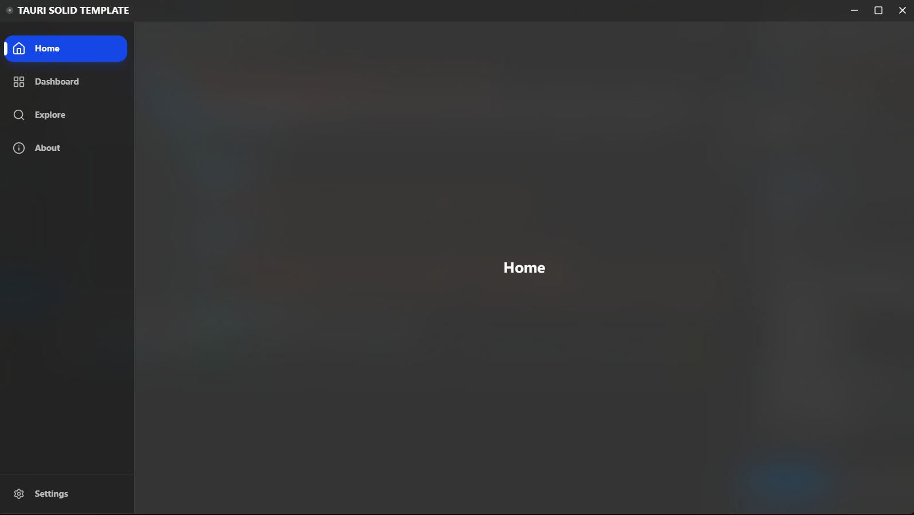

# Tauri + Solid Template




Biome + Bun + Lucide + Rust + Solid + Tanstack + Tauri + Tailwind + TS + Vite

## Introduction

We aim to use the least tools to achieve a modern fast application.

| Tool | Description |
| :--- | :--- |
| **Biome** | Modern linter and formatter for JS, JSON, TS. |
| **Bun** | Modern package manager and TS runtime. |
| **Lucide** | Beautiful & consistent icon toolkit. |
| **Rust** | Zero-cost abstractions and memory-safe programming language. |
| **Solid** | Fine-grained reactivity and declarative TypeScript-First library. |
| **Tanstack** | Powerful routing and state management libraries. |
| **Tauri** | Framework for building memory-safe and lightweight binaries. |
| **Tailwind** | Atomic utility-first CSS framework. |
| **TypeScript** | Statically typed superset of JavaScript. |
| **Vite** | Modern frontend dev and build tool. |

## Installation

1. Install [Bun](https://bun.sh/).
2. Clone this repository:
   ```bash
   git clone https://github.com/Firstastor/tauri-solid-template.git
   cd tauri-solid-template
   bun install
    ```
3. Start:
   ```bash
   bun tauri dev
   ```
Minimalist but Max-Fast!

## Template Structure
- `src/` - Solid (TypeScript) source code.
- `src-tauri/` - Tauri (Rust) source code.

### Tanstack Route
- `src/routeTree.gen.ts` - Auto-generated route tree (Don't edit **!**).
- `src/routes/__root.tsx` - The root layout component.
- `src/routes/index.tsx` - The index page component.

If you want to add a route, for example named `/about`, create a file `src/routes/about.tsx`:
```TypeScript
import { createFileRoute } from "@tanstack/solid-router";

// Must name the export "Route" and the value in createFileRoute is the path.
export const Route = createFileRoute("/about")({
	component: About,
});

function About() {
	return <div></div>;
}
```

### UI/UX

#### Styling & Animations
`App.css` - Global styles using Tailwind CSS v4, designed for modern desktop aesthetics.

*   **Tailwind CSS**: Utilizing advanced features like `@custom-variant dark (&:is(.dark *))`. This allows you to write `dark:bg-primary` and have it correctly trigger when the `.dark` class is applied to the `html` element by the system theme listener.
*   **tw-animate-css**: Integrated for high-performance, declarative animations. Simply use classes like `animate-fade-in` or `animate-fade-in-left` to bring your UI to life with minimal effort.

#### Layout Components
*   `src/components/layouts/Titlebar.tsx`: A custom titlebar that handles window controls and applies native effects (like Acrylic on Windows or Vibrancy on macOS).
*   `src/components/layouts/Sidebar.tsx`: A modern, collapsible sidebar that saves space by default and expands on hover, featuring smooth transitions and active route highlighting.

> #### Pay attention  
> If you want to use window Effects (like Acrylic), you must ensure the background color has a degree of opacity.  
> e.g., use `bg-background/30` instead of `bg-background` in your component classes.